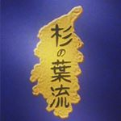

Learn the techniques needed to grade in Suginoha-ryu style of jujutsu or judo!

Or better yet, help me finish this app. :D

## Todo
* Setting: choose between judo or jujutsu
* Sorting: when sorting by belt, it should sort by belt rank and not alphabetical
* Scenario: separate card and table views
  * Cards are useful for "memory training" the japanese names
  * Table is useful for lookup and get more details on a technique
